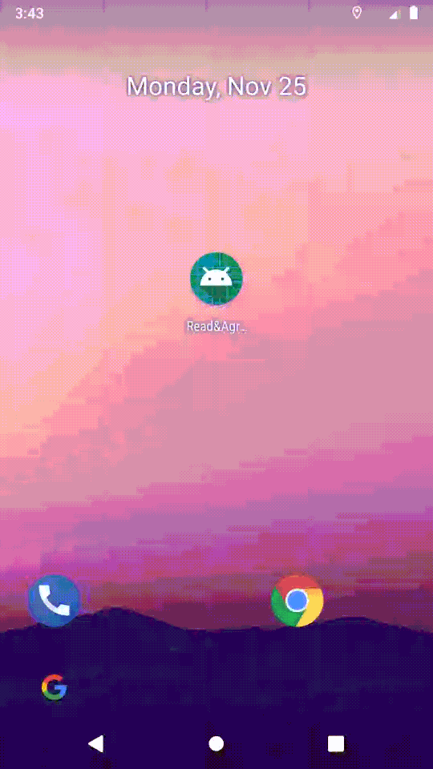

# ReadAgree

[![auc][aucSvg]][auc] [![api][apiSvg]][api] [![build][buildSvg]][build] [![License][licenseSvg]][license]

## [README of Chinese][readme-cn]

## About

**[ReadAgree][readme]** is show read and agree Privacy Policy and Terms & Conditions in your apps.

**Feature:**

- [x] Support for initial installation and second open portal configuration
- [x] Support internationalization
- [x] Support for configuring Assets(html) and Web url(html)
- [ ] Support local memory card (html)
- [ ] Common controls

## Download

Gradle:
```
implementation 'io.wamsai.readagree:readagree:0.0.3'

// if u not use AndroidX, use the following
implementation 'io.wamsai.readagree:readagree-support:0.0.3'
```

## Use

Application init:
```
// I18N
HashMap<Locale, String> anotherLocale = new HashMap<>();
anotherLocale.put(Locale.ENGLISH, "https://github.com/");
anotherLocale.put(Locale.SIMPLIFIED_CHINESE, "http://www.baidu.com");

IReadAgree readAgree = ReadAgree.config(this)
        .addReadAgreeItem(new PrivacyPolicy(
                R.string.privacy_policy,
                "privacy_policy.html"))
        .addReadAgreeItem(new TermsConditions(
                R.string.user_agreement,
                "terms_and_conditions.html"))
        .addReadAgreeItem(new BaseReadAgreeItem(
                Consts.KEY_ANOTHER_AGREEMENT,
                R.string.another_agreement,
                anotherLocale.get(Locale.ENGLISH), // DEFAULT ENGLISH
                anotherLocale))
        .install();
```

LaunchActivity:
```
public class LaunchActivity extends AppCompatActivity {

    @Override
    protected void onCreate(Bundle savedInstanceState) {
        ...

        boolean isNeed = ReadAgree.showReadAgreeDialogIfNeed(this, isAgree -> {
            if (isAgree) {
                finish();
                Intent intent = new Intent(LaunchActivity.this, MainActivity.class);
                startActivity(intent);
            } else {
                // ReadAgree will exit app
            }

            return false; // not handle
        });

        if (!isNeed) {
            new Handler().postDelayed(() -> {
                finish();
                Intent intent = new Intent(LaunchActivity.this, MainActivity.class);
                startActivity(intent);
            }, 3000);
        }
    }
}
```

AboutActivity:
```
public class AboutActivity extends AppCompatActivity {
    @Override
    protected void onCreate(Bundle savedInstanceState) {
        ...
        // Make TextView text clickable, onClick goto privacy_policy.html...
        ReadAgreeUtils.setClickableContent(ReadAgree.getInstance(), mTvClickContent);

        // Button onClick goto privacy_policy.html...
        mBtnPrivacyPolicy.setOnClickListener(v -> {
            ReadAgreeItem item = ReadAgree.findReadAgreeItem(Consts.KEY_PRIVACY_POLICY);
            if (item != null) {
                item.onToUrl(MainActivity.this);
            }
        });

        // Button onClick goto terms_and_conditions.html...
        mBtnUserAgreement.setOnClickListener(v -> {
            ReadAgreeItem item = ReadAgree.findReadAgreeItem(Consts.KEY_TERMS_AND_CONDITIONS);
            if (item != null) {
                item.onToUrl(MainActivity.this);
            }
        });

        // Button onClick goto another_agreement.html...
        mBtnAnotherAgreement.setOnClickListener(v -> {
            ReadAgreeItem item = ReadAgree.findReadAgreeItem(Consts.KEY_ANOTHER_AGREEMENT);
            if (item != null) {
                item.onToUrl(MainActivity.this);
            }
        });
    }
}
```

## Sample

[Donwload](https://github.com/WAMsAI/readagree.git) and Run. 




## Contact
<wamsai@qq.com>

## [Change Log][changeLog.md]

[aucSvg]: https://img.shields.io/badge/ReadAgree-v0.0.3-brightgreen
[auc]: https://github.com/WAMsAI/readagree

[apiSvg]: https://img.shields.io/badge/API-19+-brightgreen.svg
[api]: https://android-arsenal.com/api?level=19

[buildSvg]: https://img.shields.io/badge/build-null-red
[build]: https://travis-ci.org/WAMsAI/readagree

[licenseSvg]: https://img.shields.io/badge/License-Apache--2.0-brightgreen.svg
[license]: https://github.com/WAMsAI/readagree/blob/master/LICENSE

[readme]: https://github.com/WAMsAI/readagree
[readme-cn]: https://github.com/WAMsAI/readagree/blob/master/README-CN.md

[changeLog.md]: https://github.com/WAMsAI/readagree/blob/master/CHANGELOG.md

[blogSvg]: 
[blog]: 

[jianshuSvg]: 
[jianshu]: 

[weiboSvg]: 
[weibo]: 

[qqgroupSvg]: 
[qqgroup]: 
